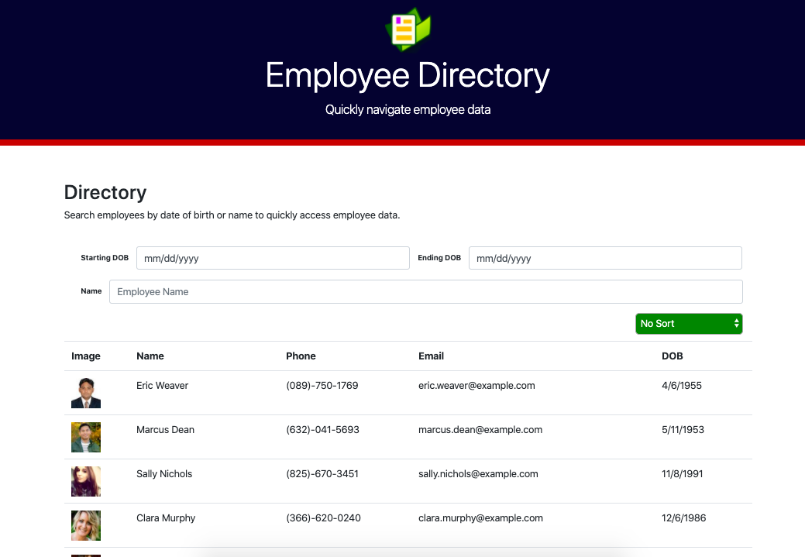
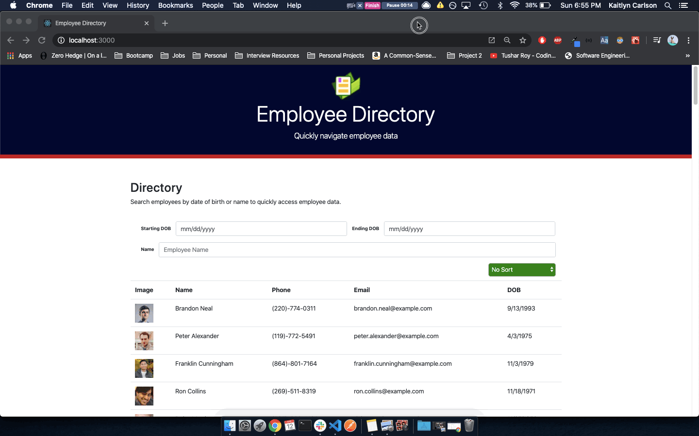
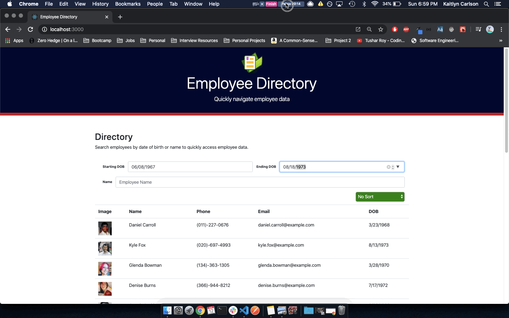
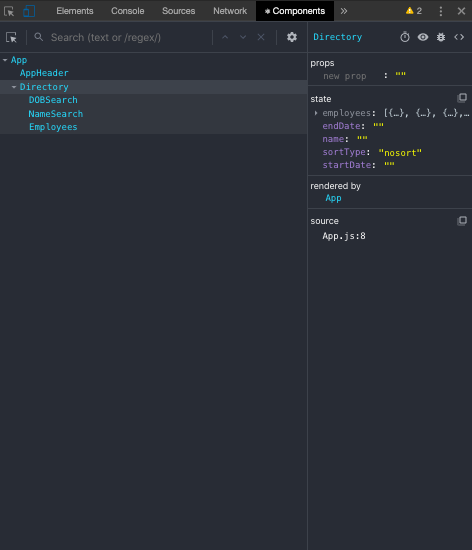

# Employee-Directory

An employee directory built with React in which employees can be searched by date of birth or by their name. Employee data can be sorted by date of birth or alphabetically.

Check out the deployed app on GitHub Pages today :

## Table of Contents

- [Overview](#Overview)
- [Technologies](#Technologies)
- [Demo](#Demo)
- [Functionality](#Functionality)
- [Future Development](#Future-Development)

## Overview

Employee Directory empowers users to view their entire employee directory, filter their employee directory, and sort their employee directory in order to ensure quick access to employee information.

## Technologies

- React
- JavaScript
- Axios
- Randomuser.me
- Bootstrap

## Demo

Users can use all search fields in conjuction or individually in order to search data. The below gifs demonstrate the use of searching for employees that fall in a range of date of birth values couple with a name search.

## Functionality

This React application's UI is broken into components which manage state and user events.

There are two main components in this app: AppHeader and Directory. The AppHeader is a dummy component which exists in isolation. All it does is render the header for our application.

The Directory component is the dangerous God component which will need to be broken down upon the incorporation of Redux and Context API. Directory has several states: employees, endDate, name, sortType, and startDate. Within the Directory component each of these states are manipulated, based upon the user's actions, with various function that enables the applications employee search and sort functionality.

These functions are then handed down with prop drilling so that our nested dummy componenets(DOBSearch, NameSearch, and Employees) can appropriately render as the various state values are manipulated.

## Future Development

- Enable a reset functionality that reverts the employee data back to it's original state
- Enable users to click on each employee and view more in-depth information
- Clean up Directory component code with the use of hooks, Redux and Context API
